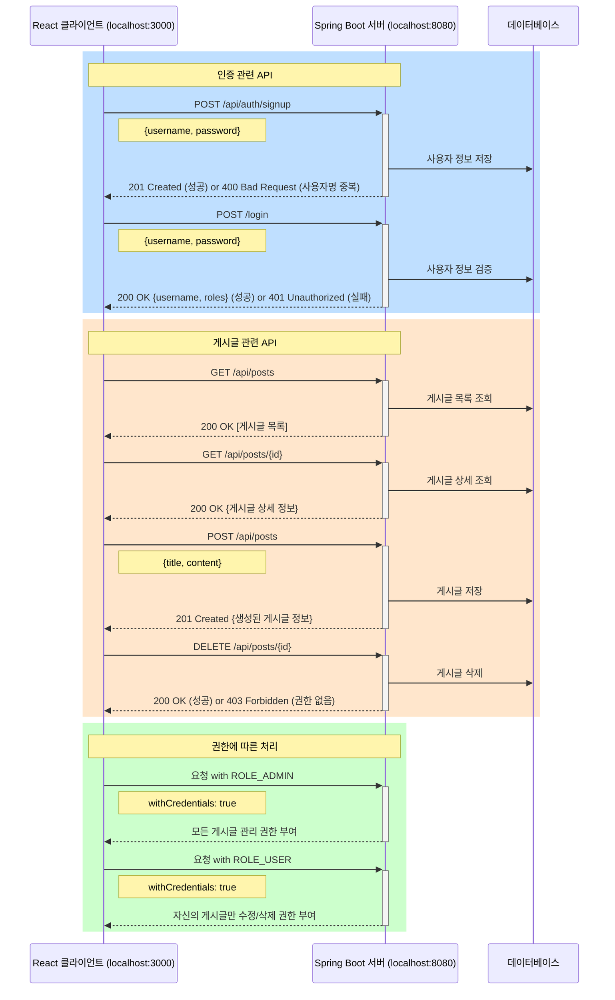
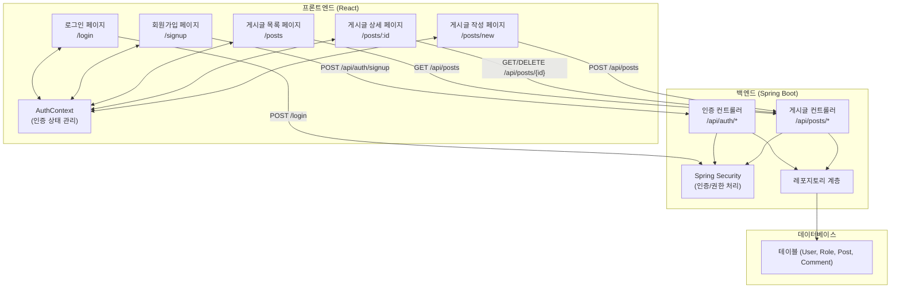
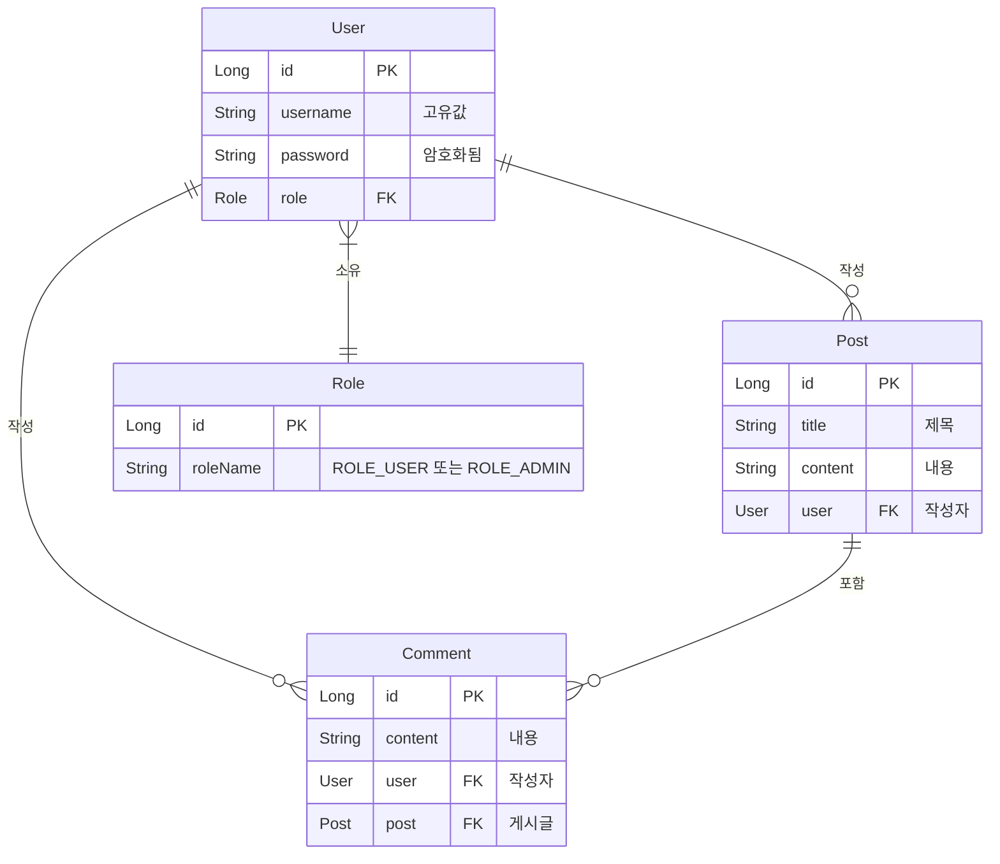

# SB-Main 프로젝트

Spring Boot 백엔드와 React 프론트엔드로 구성된 게시판 애플리케이션 프로젝트입니다.

## API 구조

아래 다이어그램은 클라이언트(React)와 서버(Spring Boot) 간의 주요 API 상호작용을 보여줍니다.

```mermaid
sequenceDiagram
    participant Client as React 클라이언트 (localhost:3000)
    participant Server as Spring Boot 서버 (localhost:8080)
    participant DB as 데이터베이스

    %% 인증 관련 API
    rect rgb(191, 223, 255)
    note over Client, Server: 인증 관련 API
    
    %% 회원가입 
    Client->>+Server: POST /api/auth/signup
    Note right of Client: {username, password}
    Server->>DB: 사용자 정보 저장
    Server-->>-Client: 201 Created (성공) or 400 Bad Request (사용자명 중복)
    
    %% 로그인
    Client->>+Server: POST /login 
    Note right of Client: {username, password}
    Server->>DB: 사용자 정보 검증
    Server-->>-Client: 200 OK {username, roles} (성공) or 401 Unauthorized (실패)
    end

    %% 게시글 관련 API
    rect rgb(255, 230, 204)
    note over Client, Server: 게시글 관련 API
    
    %% 게시글 목록 조회
    Client->>+Server: GET /api/posts
    Server->>DB: 게시글 목록 조회
    Server-->>-Client: 200 OK [게시글 목록]
    
    %% 게시글 상세 조회
    Client->>+Server: GET /api/posts/{id}
    Server->>DB: 게시글 상세 조회
    Server-->>-Client: 200 OK {게시글 상세 정보}
    
    %% 게시글 작성
    Client->>+Server: POST /api/posts
    Note right of Client: {title, content}
    Server->>DB: 게시글 저장
    Server-->>-Client: 201 Created {생성된 게시글 정보}
    
    %% 게시글 삭제 (관리자 또는 작성자)
    Client->>+Server: DELETE /api/posts/{id}
    Server->>DB: 게시글 삭제
    Server-->>-Client: 200 OK (성공) or 403 Forbidden (권한 없음)
    end

    %% 권한 구분
    rect rgb(204, 255, 204)
    note over Client, Server: 권한에 따른 처리
    
    %% 관리자 권한 (ROLE_ADMIN)
    Client->>+Server: 요청 with ROLE_ADMIN
    Note right of Client: withCredentials: true
    Server-->>-Client: 모든 게시글 관리 권한 부여
    
    %% 일반 사용자 권한 (ROLE_USER)
    Client->>+Server: 요청 with ROLE_USER
    Note right of Client: withCredentials: true
    Server-->>-Client: 자신의 게시글만 수정/삭제 권한 부여
    end
```

## 아키텍처 구조

```mermaid
flowchart TD
    subgraph "프론트엔드 (React)"
        LoginPage["로그인 페이지\n/login"]
        SignupPage["회원가입 페이지\n/signup"]
        PostListPage["게시글 목록 페이지\n/posts"]
        PostDetailPage["게시글 상세 페이지\n/posts/:id"]
        PostCreatePage["게시글 작성 페이지\n/posts/new"]
        AuthContext["AuthContext\n(인증 상태 관리)"]
    end

    subgraph "백엔드 (Spring Boot)"
        AuthController["인증 컨트롤러\n/api/auth/*"]
        PostController["게시글 컨트롤러\n/api/posts/*"]
        SecurityConfig["Spring Security\n(인증/권한 처리)"]
        repositories["레포지토리 계층"]
    end

    subgraph "데이터베이스"
        tables["테이블 (User, Role, Post, Comment)"]
    end

    %% 프론트엔드 내부 연결
    LoginPage <--> AuthContext
    SignupPage <--> AuthContext
    PostListPage <--> AuthContext
    PostDetailPage <--> AuthContext
    PostCreatePage <--> AuthContext

    %% 프론트엔드-백엔드 연결
    LoginPage -->|"POST /login"| SecurityConfig
    SignupPage -->|"POST /api/auth/signup"| AuthController
    PostListPage -->|"GET /api/posts"| PostController
    PostDetailPage -->|"GET/DELETE /api/posts/{id}"| PostController
    PostCreatePage -->|"POST /api/posts"| PostController

    %% 백엔드 내부 연결
    AuthController --> SecurityConfig
    PostController --> SecurityConfig
    AuthController --> repositories
    PostController --> repositories
    repositories --> tables
```

## 데이터 모델

```mermaid
erDiagram
    User ||--o{ Post : "작성"
    User ||--o{ Comment : "작성"
    Post ||--o{ Comment : "포함"
    User }|--|| Role : "소유"

    User {
        Long id PK
        String username "고유값"
        String password "암호화됨"
        Role role FK
    }

    Role {
        Long id PK
        String roleName "ROLE_USER 또는 ROLE_ADMIN"
    }

    Post {
        Long id PK
        String title "제목"
        String content "내용"
        User user FK "작성자"
    }

    Comment {
        Long id PK
        String content "내용"
        User user FK "작성자"
        Post post FK "게시글"
    }
``` 